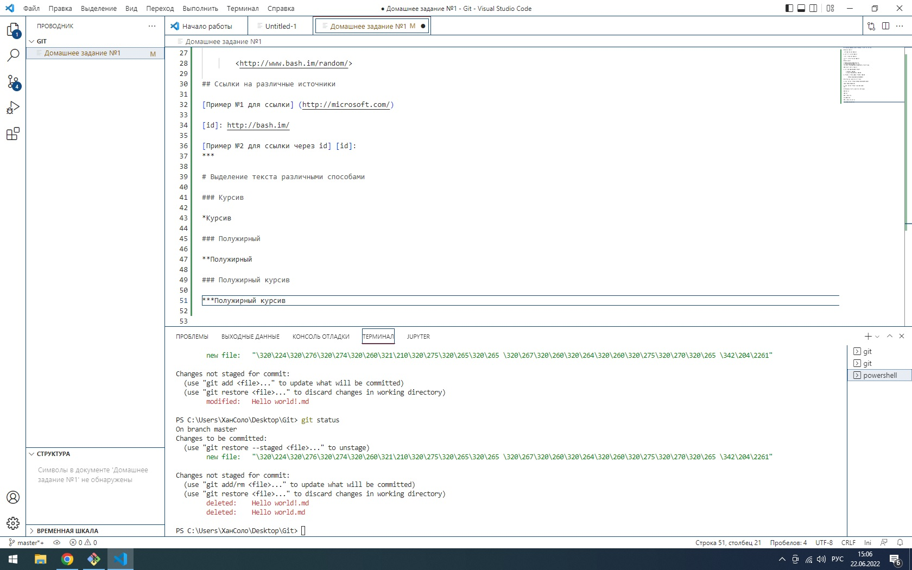

# Домашняя работа

## Списки

Для создания списков можно использовать (*), например:

* Список

Или можно использовать (+ или -), например:

+ С плюсом
- С минусом

Для создания списков нумерованных используем (1.), например:

1. Первый
2. Второй

## Работа с текстом

Для работы с текстом можно выделять (*) для курсива и (**) для жирного текста. Например:

*текст*

**полужирный**

Альтернативно можно использовать (_), например:

_текст_

__полужирный__

Это делается для того, чтобы можно было использовать в тексте различные выделения, например:

_текст курсивом, а в нем **полужирный текст**_

## Цитаты

Для создания цитат используем (>), например:

>Цитата
>>Подцитата
>>>И т.д.

## Ссылки

Для создания ссылок используем [для написания текста] и (для вставки ссылки), например:

[Текст для ссылки](http://www.microsoft.com)

## Изображение

## Таблицы

## Работа с Git Hub

Для создания удаленного репозитория необходимо зарегистрироваться на [GitHub](www.github.com) после чего создать там удаленный репозиторий.

Для добавления своей работы необходимо сделать push-реквест, используя команду (git push название)

## Добавление в удаленный репозиторий

Для добавления в удаленный репозиторий необходимо использовать (git pull)

+++++